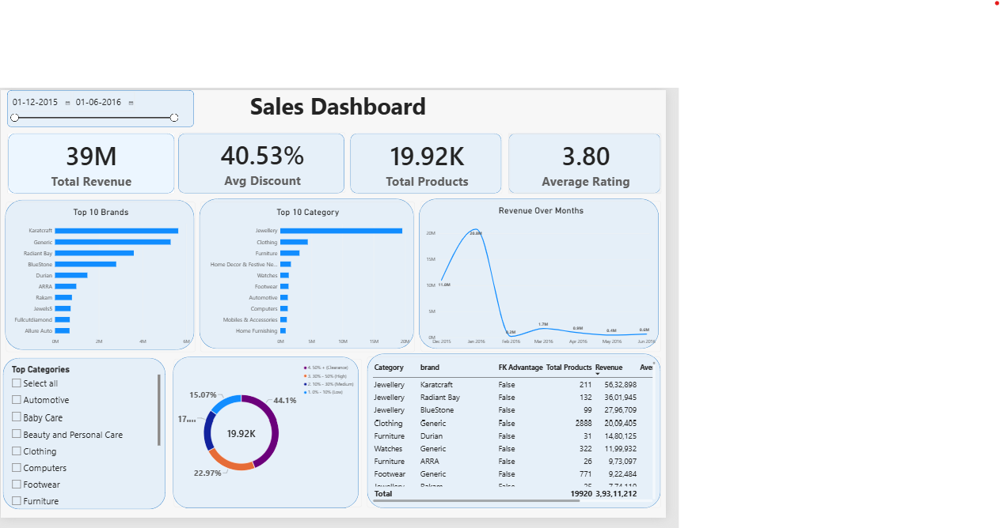

# 🛒 Flipkart E-Commerce Sales & Product Performance Dashboard

An end-to-end data analytics project analyzing product pricing, category performance, customer ratings, and sales trends on Flipkart.

---

## 📊 Dashboard Preview

---

## 🛠️ Tech Stack & Tools
- **Data Visualization & Dashboard:** Microsoft Power BI, DAX
- **Data Cleaning & Wrangling:** Python (Pandas, NumPy) / SQL
- **Code Editor:** Visual Studio Code
- **Version Control:** Git & GitHub

---

## 🔍 Key Business Questions & Insights
- **Pricing & Discount Strategies:** Evaluated retail price vs. discounted price across top product categories to analyze discount depth.
- **Category Performance:** Identified top-selling categories driving the majority of volume and revenue.
- **Rating vs. Sales Correlation:** Assessed customer satisfaction metrics and ratings distributions across leading brands.
- **Inventory & Catalog Health:** Pinpointed product segments with low ratings or high price fluctuations for strategic optimization.

---

## 📁 Repository Structure
- `Flipkart_Analysis.ipynb`: Data cleaning, EDA, and preprocessing pipeline.
- `flipkart_dashboard.pbix`: Interactive Power BI dashboard file.
- `dashboard_preview.png`: High-resolution dashboard screenshot.
- `data/`: Cleaned dataset used for reporting.
